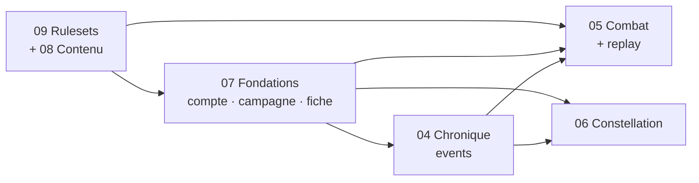

# 03 — Périmètre MVP et roadmap

← [[00 - Index]]

## Principe de découpage

Le brief définit 3 axes. Mais **la Chronique est la colonne vertébrale** : le Combat (replay) et la Constellation (liens auto-suggérés) en dépendent. Les *Fondations* (compte, campagne, fiche) sont un prérequis de tout.

## Jalons proposés

| Jalon                      | Contenu                                                                                           | Valeur démontrable                         |
| -------------------------- | ------------------------------------------------------------------------------------------------- | ------------------------------------------ |
| **M0 — Socle**             | Auth, campagne, rôles, ruleset D&D 5e SRD importé ([[08 - Contenu et licences]]), pipeline CI     | « Je me connecte et je crée une campagne » |
| **M1 — Fiche & Chronique** | Fiche PJ complète, inventaire, XP/niveau, journal d'événements manuel + auto, timeline, recherche | « Ma campagne a une mémoire »              |
| **M2 — Combat**            | Scène (map + grille), tokens, tracker, statuts, mesures, temps réel, journalisation               | « On joue un combat entier dessus »        |
| **M3 — Replay**            | Rejeu d'un combat depuis les events, annotations                                                  | « Effet Chess.com »                        |
| **M4 — Constellation**     | Graphe 3D, création de liens, vue par nœud, suggestions depuis la Chronique                       | « Effet wow / portfolio »                  |
| **M5 — Polish**            | Mobile, perf, démo publique, doc                                                                  | Portfolio prêt                             |

> [!tip] Ordre alternatif
> Si l'objectif portfolio prime : faire **M4 avant M3** (la Constellation est plus visuelle et moins dépendante du temps réel). Voir [[12 - Questions ouvertes]].

## Matrice MoSCoW du MVP (vue d'ensemble)

| Pilier | Must | Should | Could | Won't (MVP) |
|---|---|---|---|---|
| [[04 - Épopée Chronique]] | Event log append-only, timeline, filtres, visibilité joueur | Sessions, récap auto, recherche plein texte | Tags libres, export | Analytics avancées |
| [[05 - Épopée Combat]] | Map+grille, tokens, initiative/tour, PV, statuts, mesure distance | Gabarits de sorts, replay, import UVTT | Brouillard de guerre, éclairage | Automatisation complète des règles, murs dynamiques |
| [[06 - Épopée Constellation]] | Nœuds/liens, vue 3D, focus sur un nœud, création rapide | Suggestions depuis events, filtre temporel | Vue joueur, clusters auto | Édition collaborative simultanée |
| [[07 - Épopée Fondations de jeu]] | Auth, campagne, fiche PJ, inventaire, XP/niveau | Objets custom, notes, level-up guidé | Sorts avancés, import de fiche | Marketplace, homebrew partagé |
