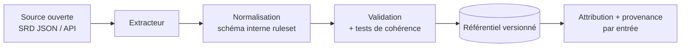

# 08 — Contenu et licences

← [[00 - Index]]

> [!warning] Point d'attention n°1 du projet
> Le brief prévoit de **scraper** le contenu D&D faute de droits. C'est le principal risque non technique du projet, *et il est évitable pour 90 % du besoin MVP*. À valider ensemble avant toute ligne de code d'import.

## Constat

| Source | Statut | Conséquence |
|---|---|---|
| Règles de base D&D 5e | Mécaniques non protégeables par le droit d'auteur, mais **texte, illustrations, noms propres (ex. Beholder, Mind Flayer)** le sont | Ne pas copier le texte des livres |
| **SRD 5.1** et **SRD 5.2** (Wizards of the Coast) | Publiés sous licence **Creative Commons CC-BY-4.0** : réutilisation commerciale ou non permise, **avec attribution** | ✅ Base légale propre pour le MVP |
| Sites tiers (D&D Beyond, etc.) | Conditions d'utilisation interdisant en général le scraping ; contenu payant/protégé | ❌ Risque juridique + technique (anti-bot, DOM instable) + inutile pour le portfolio public |
| Contenu non-SRD (Xanathar, Tasha, monstres non-SRD…) | Protégé | ❌ Ne pas redistribuer |

> [!note]
> Ce document est un cadrage produit, pas un avis juridique. Vérifier le texte exact des licences et de l'attribution requise avant publication.

## Recommandation

**Remplacer « scraper » par « ingérer des sources ouvertes »** :

1. **SRD officiel** (CC-BY-4.0) comme socle : classes, sorts, monstres, objets, conditions, règles.
2. **Sources déjà structurées** (API/dumps JSON de la communauté dérivés du SRD, ex. *Open5e*, *dnd5eapi*) → pas de scraping, données propres, versionnées. Vérifier leur licence individuellement.
3. **Contenu perso/homebrew** : l'utilisateur saisit ou importe **son propre** contenu (objets custom [[07 - Épopée Fondations de jeu]], monstres custom). C'est aussi le meilleur argument produit : *« apportez votre contenu, nous apportons l'outil »*.
4. **Contenu sous licence tiers** (ex. OGL/ORC, éditeurs partenaires) : à traiter au cas par cas, hors MVP.

## Pipeline d'ingestion (si on garde une couche « import »)

| ID | Exigence | Prio |
|---|---|:-:|
| CNT-01 | Chaque entrée porte `source`, `licence`, `version`, `attribution` | M |
| CNT-02 | Page « Crédits & licences » dans l'app (exigence CC-BY) | M |
| CNT-03 | Import **hors-ligne** versionné (pas de dépendance runtime à un tiers) | M |
| CNT-04 | Séparation stricte *contenu officiel* / *contenu utilisateur* en base | M |
| CNT-05 | Support i18n (EN d'abord ; FR = traduction communautaire à vérifier côté licence) | S |
| CNT-06 | Mécanisme d'import de **packs utilisateur** (JSON) | S |

> [!question] Décision à prendre
> - On part sur **SRD uniquement** pour le MVP ? (**Reco : oui**, et c'est aussi ce qui permet un portfolio public sans risque.)
> - Si le scraping reste souhaité pour un usage **strictement privé**, on l'isole dans un outil séparé, non déployé, non publié. À discuter.
